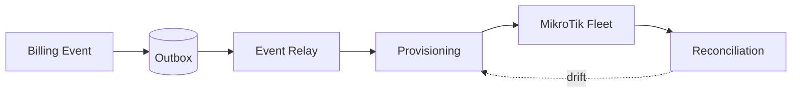

 

  

 

 

<table width="100%">
<tr>
<td width="50%" valign="top">

### About

I design backend systems that stay correct under pressure — retries, partial failures, race conditions. My interest sits at the intersection of software architecture and network automation: the moment a business decision has to become a real, physical network action.

</td>
<td width="50%" valign="top">

### Mindset

I favor boring, provable solutions over clever ones. I'd rather ship a system that's easy to reason about at 3 AM than one that's impressive in a design review.

</td>
</tr>
</table>

 

 

 

### Currently

**Building** Nexora &nbsp;·&nbsp; **Exploring** distributed consensus &nbsp;·&nbsp; **Reading** on event-driven architecture

 

 

## Stack

LANGUAGES
 

  

BACKEND &nbsp;&amp;&nbsp; FRONTEND
 

  

DATA
 

  

INFRASTRUCTURE
 

  

MESSAGING
 

 

 

## Architecture Principles

<table width="100%">
<tr><td width="4%" align="center">01</td><td>State is sacred — two systems should never quietly disagree about it.</td></tr>
<tr><td align="center">02</td><td>Every distributed system lies eventually. Design for that, not around it.</td></tr>
<tr><td align="center">03</td><td>Idempotency beats optimism.</td></tr>
<tr><td align="center">04</td><td>Failures deserve architecture, not a try/catch and a prayer.</td></tr>
<tr><td align="center">05</td><td>Latency is a product feature, not an infrastructure footnote.</td></tr>
</table>

 

 

## Learning Roadmap

<table width="100%">
<tr><th align="left">Stage</th><th align="left">Focus</th></tr>
<tr><td>Foundation</td><td>PHP, Laravel, relational database design</td></tr>
<tr><td>Depth</td><td>TypeScript, NestJS, queues, caching strategy</td></tr>
<tr><td>Systems</td><td>Distributed systems, CQRS, event-driven design</td></tr>
<tr><td>Networking</td><td>MikroTik automation, FreeRADIUS, SNMP topology</td></tr>
<tr><td><b>Now</b></td><td>Synchronizing billing state with real network state</td></tr>
<tr><td>Next</td><td>Formal reasoning about distributed state machines</td></tr>
</table>

 

 

## Featured Project

<h3>Nexora</h3>
A multi-tenant operating system for ISPs — billing, AAA, and network enforcement, kept in sync.

  

 

<b>Why this is hard</b>

 

Billing state lives in a database; network state lives on physical devices that can be offline, slow, or lying about their own status. Keeping the two in sync — without blocking billing on flaky hardware, or letting the network drift silently — is the core problem Nexora solves.

 

 

## Metrics

 

 

 

 

### Let's talk systems.

  

